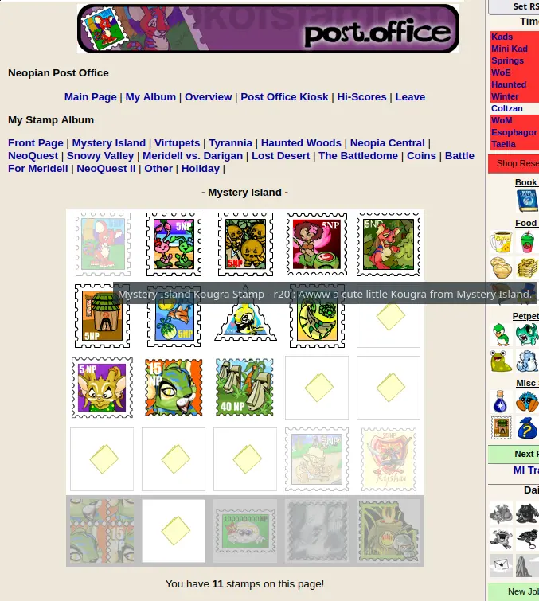

# npc-stamp-album-helper (wip)

userscript for neopestsclassic. Shows a placeholder of the stamp in stamp albums and provides a shop wizard link.

based on [Stamp album helper](https://www.reddit.com/r/neopets/comments/ldrb2d/userscript_stamp_album_helper_i_made_this_tool/) for neopets by [Fruit_Loopita](https://www.reddit.com/user/Fruit_Loopita/)

idea to port to npc by [corinne](https://neopetsclassic.com/userlookup/?user=corinne)

install:
[click here](./script.user.js) then  click the button "raw"

screenshot:

